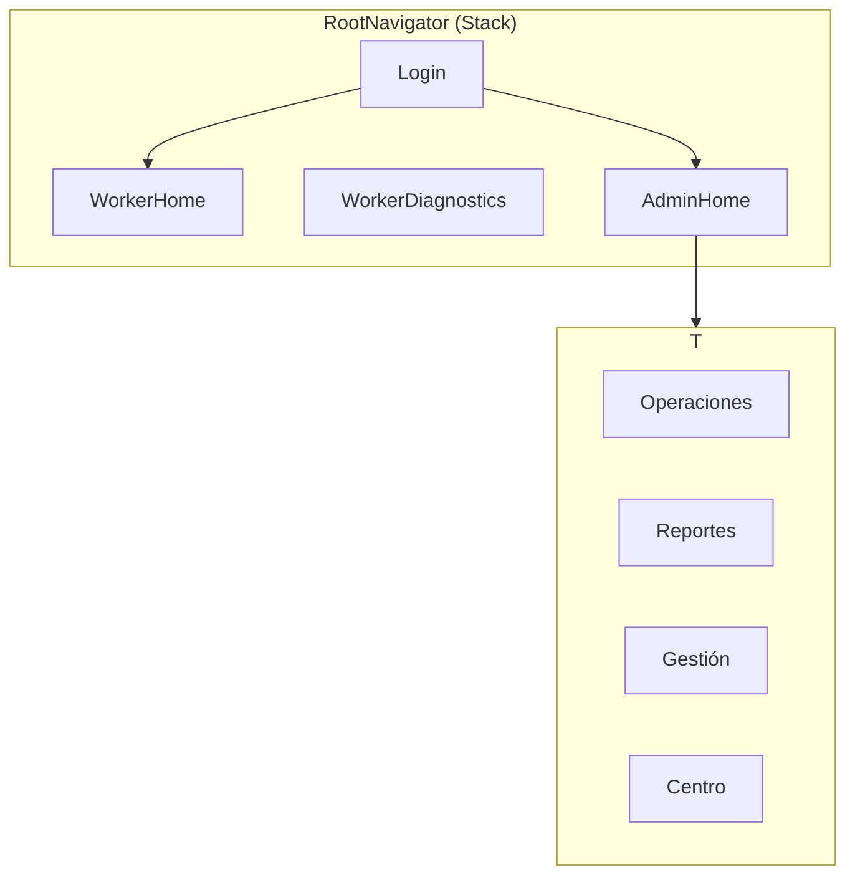

# Fleet Control (mobile-rn)

Aplicación móvil **React Native + Expo** para flota en campo: administración, mapa en vivo, seguimiento y reportes, alineada con el producto **Fleet Control** (migración desde el cliente Flutter).

---

## Contenido

- [Requisitos](#requisitos)
- [Stack técnico](#stack-técnico)
- [Estructura del repositorio](#estructura-del-repositorio)
- [Navegación](#navegación)
- [Configuración (Supabase, mapas, permisos)](#configuración)
- [Instalación y desarrollo](#instalación-y-desarrollo)
- [Build Android (APK / AAB)](#build-android-apk--aab)
- [Scripts npm](#scripts-npm)
- [Problemas conocidos (Windows / CMake)](#problemas-conocidos-windows--cmake)
- [Evidencia académica / rúbricas](#evidencia-académica--rúbricas)

---

## Requisitos

| Herramienta | Uso |
|------------|-----|
| **Node.js** (LTS recomendado) | `npm` y Metro |
| **Android Studio** + SDK / emulador | compilar y probar en Android |
| Cuenta **Expo** (opcional) | EAS Build en la nube |
| Cuenta **Supabase** | base de datos y autenticación |
| Clave **Maps SDK for Android** (Google Cloud) | mapas en el panel admin |

> El proyecto declara `package: com.fleetcontrol.mobile` en `app.json`; debe ser coherente con el registro en Google Cloud (OAuth / firma) si aplicas servicios de Google.

---

## Stack técnico

- **Expo** ~54 · **React** 19 · **React Native** 0.81
- **TypeScript** (estricto) · **@react-navigation/native** (Stack + tabs)
- **@supabase/supabase-js** + `AsyncStorage` (sesión)
- **react-native-maps** (Google Maps en Android) · **expo-location** + tarea en segundo plano
- **expo-notifications** (push y locales) · **expo-print** / **expo-sharing** (exportes en admin)

El punto de entrada carga el registro de tareas de ubicación en segundo plano:

```1:2:index.ts
import './src/tasks/backgroundLocationTask';
```

`App` inicializa notificaciones push y envuelve la app en `SafeAreaProvider` y `RootNavigator` (`App.tsx`).

---

## Estructura del repositorio

```text
mobile-rn/
├── App.tsx                 # Raíz: StatusBar, push init, RootNavigator
├── app.json                # Nombre, Android, permisos, Google Maps, plugins Expo
├── eas.json                # Perfiles EAS (APK / AAB)
├── index.ts                # Entrada: background task + registerRootComponent
├── src/
│   ├── auth/               # Usuario, permisos, repositorio de credenciales
│   ├── components/         # Componentes reutilizables (p. ej. mapa)
│   ├── config/              # supabaseConfig (env públicas EXPO_PUBLIC_*)
│   ├── core/                # permisos, notificaciones locales, helpers
│   ├── data/                # repositorios Supabase (ubicaciones, equipo, base)
│   ├── domain/              # tipos de dominio (trabajador, ubicación, base)
│   ├── hooks/               # hooks (p. ej. useWorkerLocations)
│   ├── lib/                 # cliente Supabase
│   ├── navigation/         # Stack raíz, tipos de navegación
│   ├── screens/             # Login, worker, admin (pestañas, operaciones, etc.)
│   ├── services/            # tracking, preferencias
│   ├── tasks/              # backgroundLocationTask
│   ├── theme/               # colores
│   └── utils/              # formateo, UI de trabajador
└── android/ (generado)     # Tras `expo prebuild` o al abrir con Android Studio
```

---

## Navegación

### Native Stack (raíz)

Definido en `src/navigation/RootNavigator.tsx` con `createNativeStackNavigator`:

- **Login** → inicio de sesión por rol
- **WorkerHome** / **WorkerDiagnostics** → flujo trabajador
- **AdminHome** → panel de administración

### Bottom tabs (admin)

Dentro del flujo admin, `src/screens/admin/AdminDashboard.tsx` define **cuatro tabs**:

| Tab | Contenido orientativo |
|-----|------------------------|
| **Operaciones** | Mapa, unidades, base operativa, replay |
| **Reportes** | Analítica, exportación (CSV/PDF según implementación) |
| **Gestion** | Equipo (trabajadores) |
| **Centro** | Ajustes / centro (según `AdminCenterTab`) |



---

## Configuración

### Supabase (URL y clave)

Lógica en `src/config/supabaseConfig.ts` y cliente en `src/lib/supabase.ts`.  
Puedes sobreescribir con variables de entorno públicas de Expo (nunca subas claves de servicio al repo de estudiantes; aquí se documentan **solo** las de cliente público):

- `EXPO_PUBLIC_SUPABASE_URL`
- `EXPO_PUBLIC_SUPABASE_ANON_KEY` o `EXPO_PUBLIC_SUPABASE_PUBLISHABLE_KEY`

Crea un archivo `.env` en la raíz o define las variables en el entorno antes de `npx expo start` (según el flujo que use tu equipo con Expo).

### Google Maps (Android)

En `app.json` → `expo.android.config.googleMaps.apiKey` debe ser una clave con **Maps SDK for Android** habilitado y, si aplica, restricción por **nombre del paquete** `com.fleetcontrol.mobile`.

> En producción conviene rotar claves si se filtran y restringirlas en Google Cloud Console; no compartas la clave en capturas de entrega.

### Notificaciones y ubicación

Permisos y textos de uso están declarados vía `expo.plugins` (expo-location, expo-notifications) en `app.json`. Ajusta los textos a lo que pida tu **Política de privacidad**.

---

## Instalación y desarrollo

En la raíz del proyecto:

```bash
npm install
```

Iniciar el bundler de Metro / Expo:

```bash
npx expo start
```

- Escanea el **QR** con **Expo Go** en un dispositivo físico, o  
- Pulsa `a` para abrir en **emulador Android** (con Android Studio configurado), o  
- `npm run run:android` (equivalente a `expo run:android`) **después** de tener carpeta `android` generada.

Carpeta nativa Android (una vez, si aún no existe o la regeneras):

```bash
npx expo prebuild --platform android
```

> Desarrollo requiere que el backend Supabase (tablas, RLS, Edge Functions) esté alineado con el código: `worker_locations`, perfiles, base operativa, etc., según tu despliegue.

---

## Build Android (APK / AAB)

### Local (Gradle) — genera `app-release.apk`

Con Android SDK y `JAVA_HOME` correctos, desde el proyecto:

```bash
cd android
./gradlew assembleRelease   # En Windows: .\gradlew assembleRelease
```

Salida típica:

`android/app/build/outputs/apk/release/app-release.apk`

### Nube — EAS (recomendado en equipos con rutas con espacios o fallos de CMake)

```bash
npx eas login
npx eas build -p android --profile preview
```

Configuración de perfiles: `eas.json` (`preview` → APK, `production` → AAB).

También puedes usar:

```bash
npm run build:apk
npm run build:aab
```

---

## Scripts npm

| Script | Descripción |
|--------|-------------|
| `npm start` | `expo start` |
| `npm run android` / `run:ios` / `web` | Ejecución en plataforma |
| `npm run prebuild:android` | `expo prebuild` solo Android |
| `npm run run:android` | `expo run:android` |
| `npm run build:apk` | EAS, perfil preview (APK) |
| `npm run build:aab` | EAS, producción (AAB) |

---

## Problemas conocidos (Windows / CMake)

En rutas con **espacios** en el nombre de carpeta, a veces falla la cadena de build nativo (Ninja/CMake) con mensajes del tipo *build.ninja still dirty*.

1. Mover o clonar el repositorio a una ruta **sin espacios** (p. ej. `C:\SpringProjectsnew\mobile-rn`).  
2. O usar **EAS Build** y evitar compilar módulos nativos pesados en la máquina local.

`gradlew clean` a veces deja codegen inconsistente: si falla, evita `clean` suelto o vuelve a `npm install` y `expo prebuild` según el caso.

---

## Evidencia académica / rúbricas

Puntos frecuentes y **dónde** capturar en este repo:

| Rúbrica / evidencia | Archivo o comando |
|---------------------|-------------------|
| `package.json` y dependencias | `package.json`, salida de `npm install` |
| Estructura de carpetas | panel Explorer en VS Code / `tree` |
| Ejecución (`npx expo start`, Metro) | terminal con Expo dev tools |
| App en emulador o físico | captura de la app |
| **Native Stack** | `src/navigation/RootNavigator.tsx` |
| **Bottom tabs** | `src/screens/admin/AdminDashboard.tsx` |
| **Componente con `props` (reutilizable)** | `src/components/map/TopDownMotoMarker.tsx` (`type Props` + `export function …`) |
| APK o EAS | `app-release.apk` en carpeta `outputs` o pantalla de EAS con build exitoso |

---

## Licencia y visibilidad

`package.json` marca el proyecto como `"private": true`. Úsalo con fines académicos o de equipo según las políticas de tu institución y de tu organización.

---

*Generado a partir de la estructura real del repositorio `mobile-rn` (Expo / React Native / Supabase / Maps). Ajusta URLs, claves y nombres de perfiles a tu despliegue concreto.*
