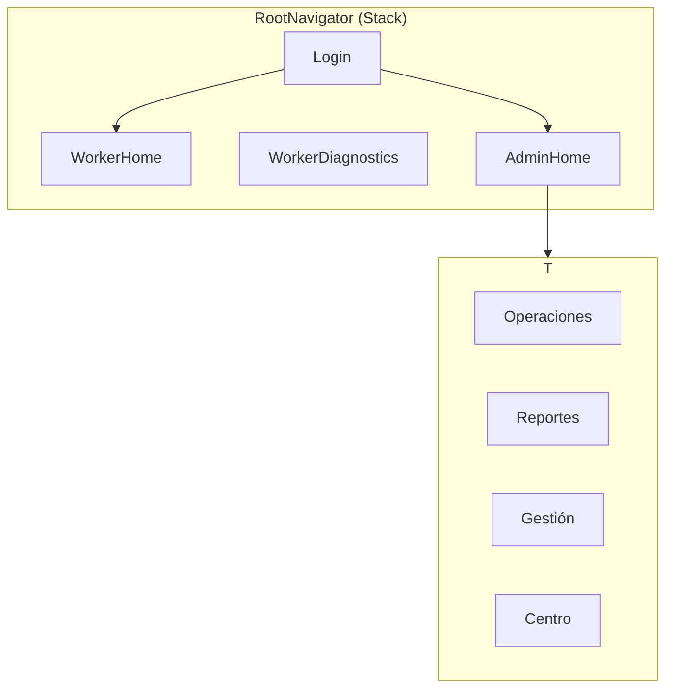

# Fleet Control (mobile-rn)

Aplicación móvil **React Native + Expo** para flota en campo: administración, mapa en vivo, seguimiento y reportes, alineada con el producto **Fleet Control** (migración desde el cliente Flutter).

---

## Documentación de arquitectura

- **[Dos apps (worker + admin), monorepo y RLS](./docs/ARCHITECTURE-two-apps.md)** — plan completo: carpetas, matriz de código, auth, 5 fases de migración, checklist Supabase y builds.

### Estado del monorepo

| Fase | Estado |
|------|--------|
| **1** Preparación (workspaces, `tsconfig.base`, `.env.example`) | Hecha |
| **2** Extraer `packages/shared-*` desde `src/` | Hecha |
| **3** App `apps/worker` (solo campo) | Hecha |
| **4** App `apps/admin` (solo supervisión) | Hecha |
| **5** RLS, pruebas, legacy archivado | Hecha (SQL y pruebas manuales pendientes en tu Supabase) |

**Producción — dos apps instalables:**

| App | Comando dev | Package Android | Build APK |
|-----|-------------|-----------------|-----------|
| Campo (worker) | `npm run start:worker` | `com.fleetcontrol.worker` | `npm run build:worker:apk` |
| Admin | `npm run start:admin` | `com.fleetcontrol.admin` | `npm run build:admin:apk` |

Documentación: [apps/worker/README.md](./apps/worker/README.md), [apps/admin/README.md](./apps/admin/README.md).  
Código compartido: **`packages/`** (`@fleet/shared-*`).  
RLS: [`supabase/README.md`](./supabase/README.md) · Prueba manual: [`docs/MANUAL-TEST-phase5.md`](./docs/MANUAL-TEST-phase5.md).  
Monolito antiguo (deprecado): `npm run start:legacy` → [apps/legacy/README.md](./apps/legacy/README.md).  
Variables: `.env.example` → `.env` en la raíz.

## Contenido

- [Requisitos](#requisitos)
- [Stack técnico](#stack-técnico)
- [Estructura del repositorio](#estructura-del-repositorio)
- [Navegación](#navegación)
- [Configuración (Supabase, mapas, permisos)](#configuración)
- [Instalación y desarrollo](#instalación-y-desarrollo)
- [Build Android (APK / AAB)](#build-android-apk--aab)
- [Scripts npm](#scripts-npm)
- [Problemas conocidos (Windows / CMake)](#problemas-conocidos-windows--cmake)
- [Evidencia académica / rúbricas](#evidencia-académica--rúbricas)

---

## Requisitos

| Herramienta | Uso |
|------------|-----|
| **Node.js** (LTS recomendado) | `npm` y Metro |
| **Android Studio** + SDK / emulador | compilar y probar en Android |
| Cuenta **Expo** (opcional) | EAS Build en la nube |
| Cuenta **Supabase** | base de datos y autenticación |
| Clave **Maps SDK for Android** (Google Cloud) | mapas en el panel admin |

> Maps en admin: restringe la API key por package `com.fleetcontrol.admin`. Legacy: `com.fleetcontrol.mobile`.

---

## Stack técnico

- **Expo** ~54 · **React** 19 · **React Native** 0.81
- **TypeScript** (estricto) · **@react-navigation/native** (Stack + tabs)
- **@supabase/supabase-js** + `AsyncStorage` (sesión)
- **react-native-maps** (Google Maps en Android) · **expo-location** + tarea en segundo plano
- **expo-notifications** (push y locales) · **expo-print** / **expo-sharing** (exportes en admin)

La app **worker** registra la tarea GPS en `apps/worker/index.ts` (`@fleet/shared-tracking-worker`).  
La app **admin** solo consume ubicaciones en tiempo real (sin tarea en segundo plano).

---

## Estructura del repositorio

```text
mobile-rn/
├── apps/
│   ├── worker/             # App campo (com.fleetcontrol.worker)
│   ├── admin/              # App supervisión (com.fleetcontrol.admin)
│   └── legacy/             # Monolito deprecado (com.fleetcontrol.mobile)
├── packages/
│   └── shared-*/           # Auth, data, UI, tracking, etc.
├── supabase/migrations/    # RLS de referencia (Fase 5)
└── docs/                   # Arquitectura y pruebas manuales
```

---

## Navegación

### Native Stack (raíz)

- **Worker:** `apps/worker` — Login → WorkerHome → WorkerDiagnostics  
- **Admin:** `apps/admin` — Login (solo admin) → AdminHome (tabs)  
- **Legacy:** `apps/legacy` — stack combinado (deprecado)

### Bottom tabs (admin)

En admin, `AdminDashboard.tsx` define **cuatro tabs**:

| Tab | Contenido orientativo |
|-----|------------------------|
| **Operaciones** | Mapa, unidades, base operativa, replay |
| **Reportes** | Analítica, exportación (CSV/PDF según implementación) |
| **Gestion** | Equipo (trabajadores) |
| **Centro** | Ajustes / centro (según `AdminCenterTab`) |



---

## Configuración

### Supabase (URL y clave)

Lógica en `packages/shared-config` y cliente en `packages/shared-lib`.  
Variables públicas de Expo:

- `EXPO_PUBLIC_SUPABASE_URL`
- `EXPO_PUBLIC_SUPABASE_ANON_KEY` o `EXPO_PUBLIC_SUPABASE_PUBLISHABLE_KEY`

Crea un archivo `.env` en la raíz o define las variables en el entorno antes de `npx expo start` (según el flujo que use tu equipo con Expo).

### Google Maps (Android)

En `apps/admin/app.config.ts` → `EXPO_PUBLIC_GOOGLE_MAPS_API_KEY` con **Maps SDK for Android** y restricción por package `com.fleetcontrol.admin`.

> En producción conviene rotar claves si se filtran y restringirlas en Google Cloud Console; no compartas la clave en capturas de entrega.

### Notificaciones y ubicación

Permisos en cada `app.config.ts` (worker: ubicación en segundo plano; admin: notificaciones). Ajusta textos a tu política de privacidad.

---

## Instalación y desarrollo

En la raíz del proyecto:

```bash
npm install
```

Iniciar una app:

```bash
npm run start:worker
# o
npm run start:admin
```

- Escanea el **QR** con **Expo Go** en un dispositivo físico, o  
- Pulsa `a` para abrir en **emulador Android** (con Android Studio configurado), o  
- `npm run run:android` (equivalente a `expo run:android`) **después** de tener carpeta `android` generada.

Carpeta nativa Android (una vez, si aún no existe o la regeneras):

```bash
npx expo prebuild --platform android
```

> Desarrollo requiere que el backend Supabase (tablas, RLS, Edge Functions) esté alineado con el código: `worker_locations`, perfiles, base operativa, etc., según tu despliegue.

---

## Build Android (APK / AAB)

### App Worker (campo)

```bash
cd apps/worker
eas build -p android --profile worker-preview
```

Desde la raíz: `npm run build:worker:apk`

### App Admin (supervisión)

```bash
cd apps/admin
eas build -p android --profile admin-preview
```

Desde la raíz: `npm run build:admin:apk`

Define en EAS o `.env`: `EXPO_PUBLIC_SUPABASE_*`, y en admin `EXPO_PUBLIC_GOOGLE_MAPS_API_KEY`.

### Legacy (monolito, no recomendado)

```bash
cd apps/legacy
eas build -p android --profile preview
```

---

## Scripts npm

| Script | Descripción |
|--------|-------------|
| `npm run start:worker` | App campo (`apps/worker`) |
| `npm run start:admin` | App admin (`apps/admin`) |
| `npm run start:legacy` | Monolito deprecado (`apps/legacy`) |
| `npm run typecheck` | TypeScript en todos los workspaces |
| `npm run build:worker:apk` | EAS APK worker |
| `npm run build:admin:apk` | EAS APK admin |

---

## Problemas conocidos (Windows / CMake)

En rutas con **espacios** en el nombre de carpeta, a veces falla la cadena de build nativo (Ninja/CMake) con mensajes del tipo *build.ninja still dirty*.

1. Mover o clonar el repositorio a una ruta **sin espacios** (p. ej. `C:\SpringProjectsnew\mobile-rn`).  
2. O usar **EAS Build** y evitar compilar módulos nativos pesados en la máquina local.

`gradlew clean` a veces deja codegen inconsistente: si falla, evita `clean` suelto o vuelve a `npm install` y `expo prebuild` según el caso.

---

## Evidencia académica / rúbricas

Puntos frecuentes y **dónde** capturar en este repo:

| Rúbrica / evidencia | Archivo o comando |
|---------------------|-------------------|
| `package.json` y dependencias | `package.json`, salida de `npm install` |
| Estructura de carpetas | panel Explorer en VS Code / `tree` |
| Ejecución (`npx expo start`, Metro) | terminal con Expo dev tools |
| App en emulador o físico | captura de la app |
| **Native Stack** | `apps/admin/src/navigation/AdminRootNavigator.tsx` o `apps/legacy/src/navigation/RootNavigator.tsx` |
| **Bottom tabs** | `apps/admin/src/screens/admin/AdminDashboard.tsx` |
| **Componente con `props` (reutilizable)** | `packages/shared-ui-admin/src/map/TopDownMotoMarker.tsx` |
| APK o EAS | `app-release.apk` en carpeta `outputs` o pantalla de EAS con build exitoso |

---

## Licencia y visibilidad

`package.json` marca el proyecto como `"private": true`. Úsalo con fines académicos o de equipo según las políticas de tu institución y de tu organización.

---

*Generado a partir de la estructura real del repositorio `mobile-rn` (Expo / React Native / Supabase / Maps). Ajusta URLs, claves y nombres de perfiles a tu despliegue concreto.*
